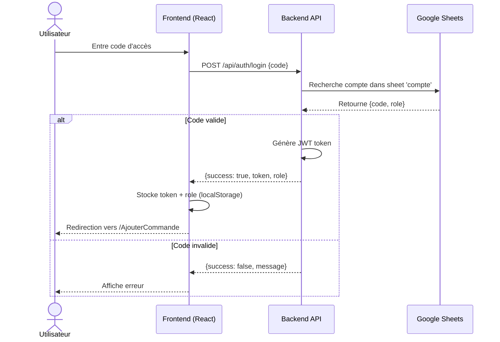
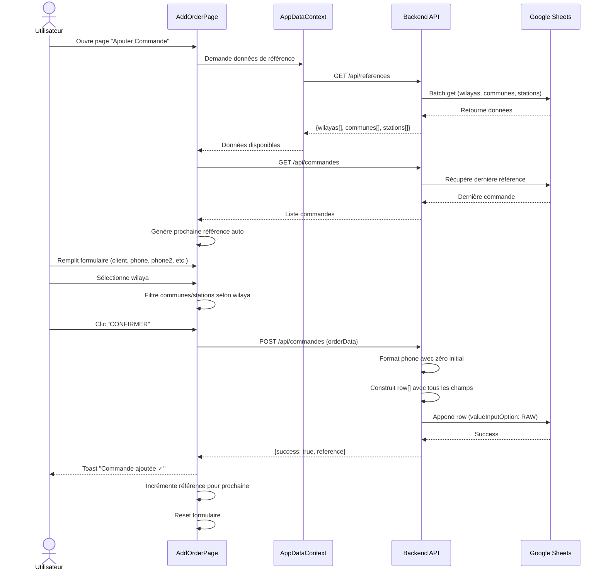
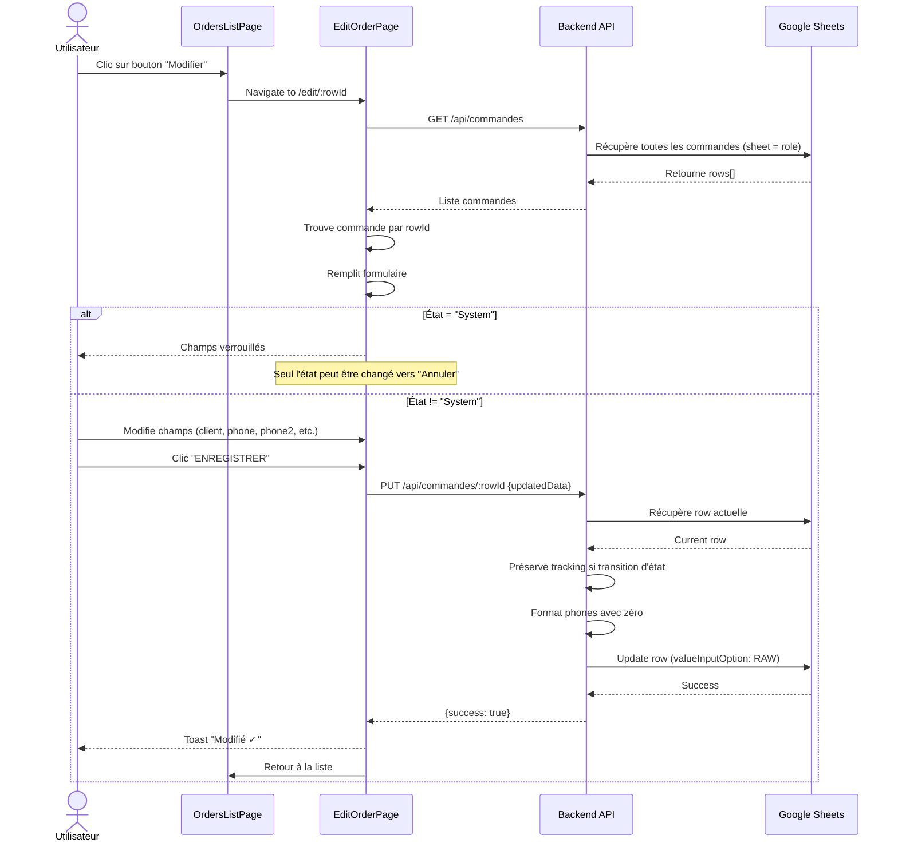
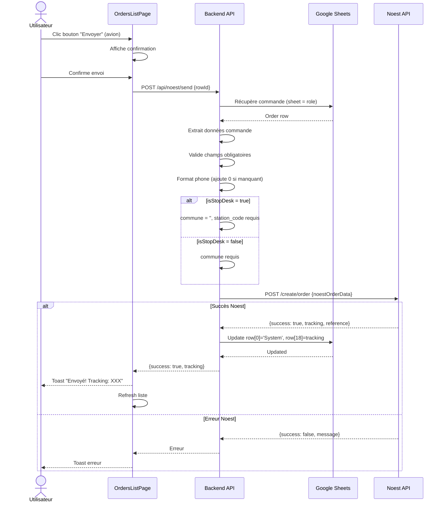
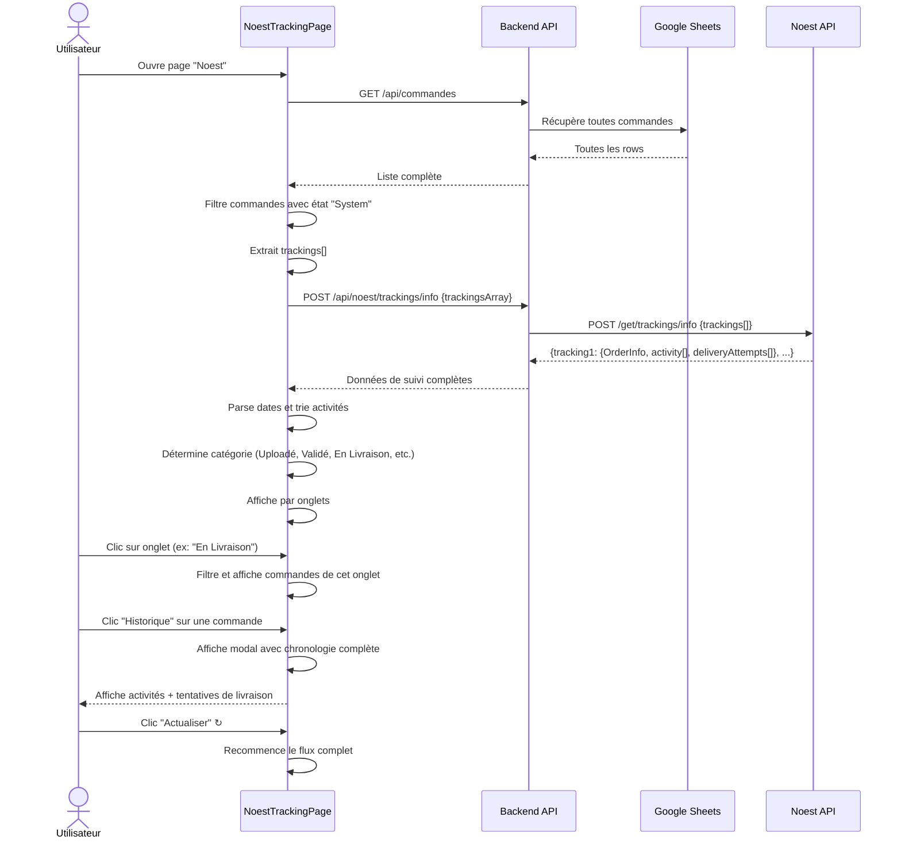
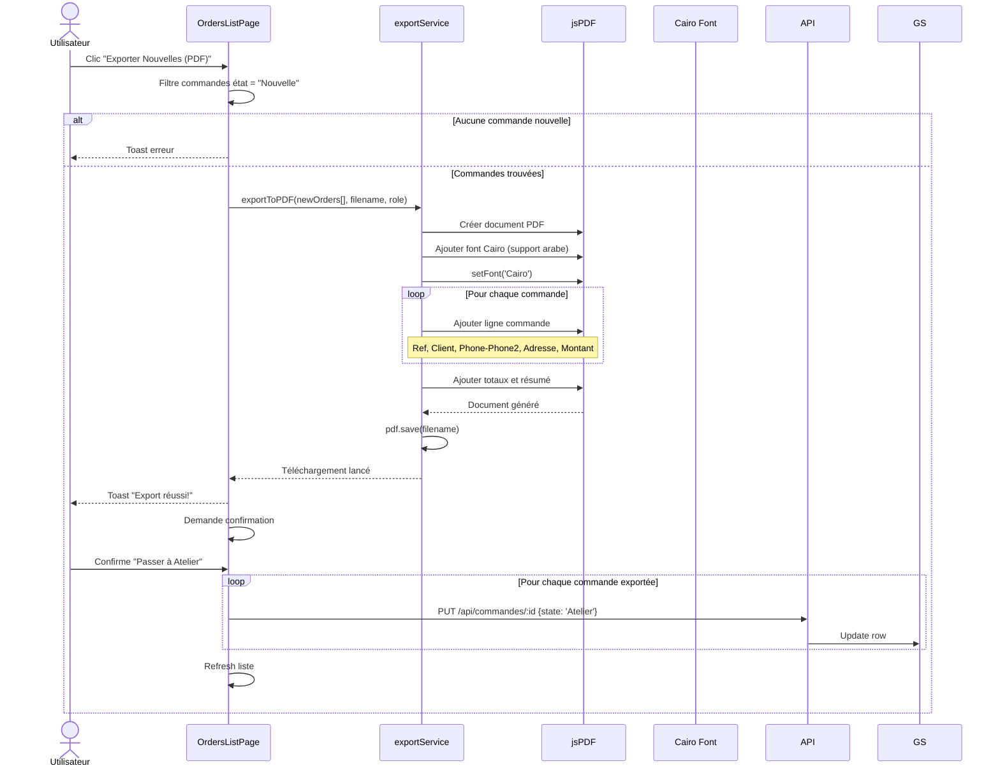
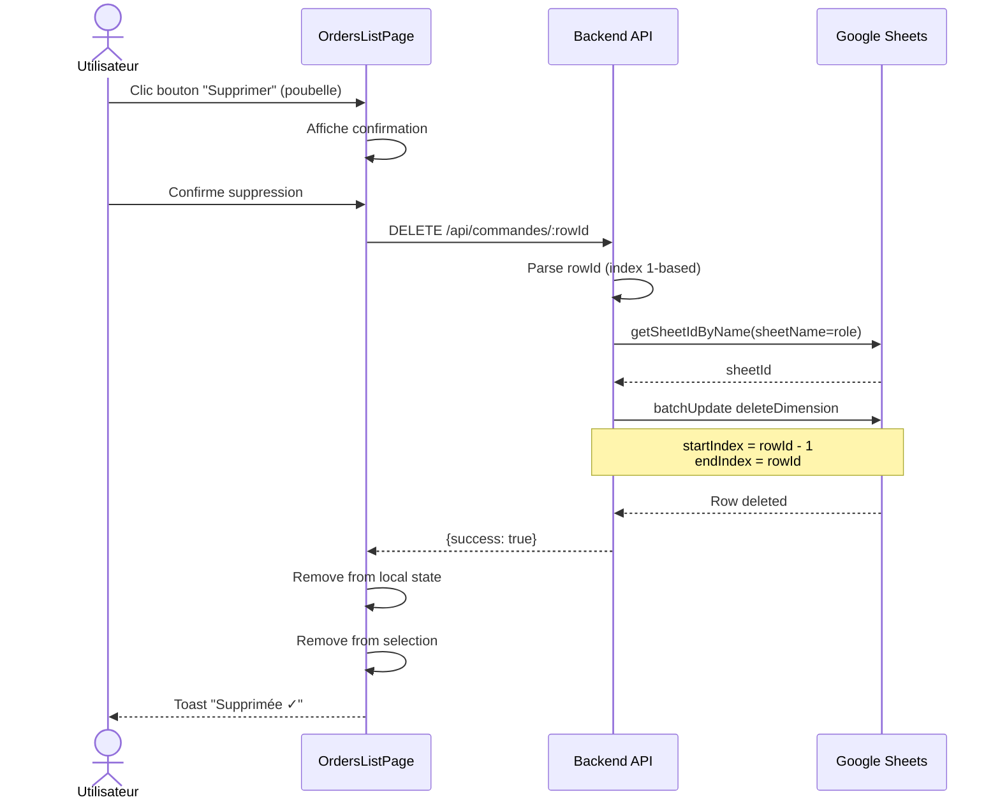
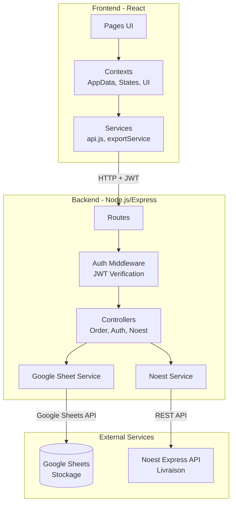
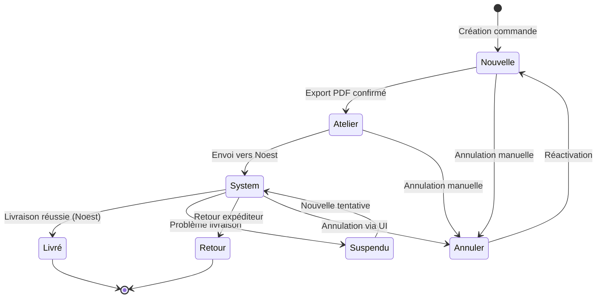

# Diagrammes de Séquence - Système de Gestion de Commandes E-commerce

## Vue d'ensemble du système

Le système est composé de :
- **Frontend** : Application React (interface utilisateur)
- **Backend** : API Node.js/Express
- **Google Sheets** : Base de données (stockage des commandes)
- **Noest API** : Service de livraison externe

---

## 1. Flux d'Authentification

---

## 2. Flux de Création de Commande

---

## 3. Flux de Modification de Commande

---

## 4. Flux d'Envoi vers Noest Express

---

## 5. Flux de Suivi Noest (Tracking)

---

## 6. Flux d'Export PDF

---

## 7. Flux de Suppression de Commande

---

## 8. Architecture Globale du Système

---

## 9. Flux de Données - Gestion d'État

---

## Notes Techniques Importantes

### Authentification
- JWT stocké dans `localStorage`
- Middleware vérifie token sur chaque requête protégée
- Role utilisé pour déterminer la feuille Google Sheets

### Stockage Google Sheets
- **valueInputOption: RAW** utilisé pour préserver zéros initiaux des téléphones
- Chaque role a sa propre feuille
- Structure: 19 colonnes (A-S)
- Format phones: `'0676343038` (avec apostrophe dans le formatage)

### Intégration Noest
- Création commande → reçoit tracking number
- État automatiquement changé à "System"
- Tracking stocké en colonne S
- Si transition System → autre état, tracking effacé

### Format Téléphone
- Frontend: input text, validation 10 chiffres max
- Backend: formatage pour garantir zéro initial
- Google Sheets: RAW préserve le format exact
- Noest API: envoi avec zéro (`0676343038`)
- Display: `phone - phone2` si phone2 existe
